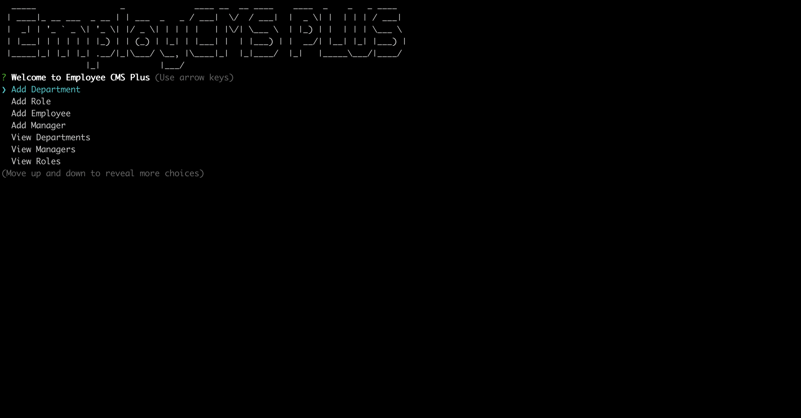

# EmployCMS PLUS

The premier employee tracking application



## Dependencies
* Chalk
* Inquirer
* Figlet
* console.table
* MySQL

## How to Run the Application
``` npm install chalk inquirer figlet console.table mysql ```


``` node index.js ```

## Uses
* For keeping track of employees
* For assigning managers to employees
* To View Total Payroll